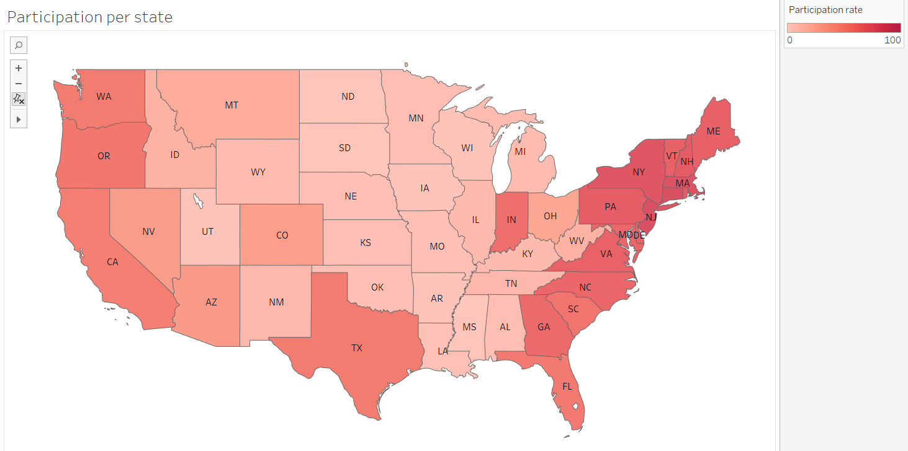
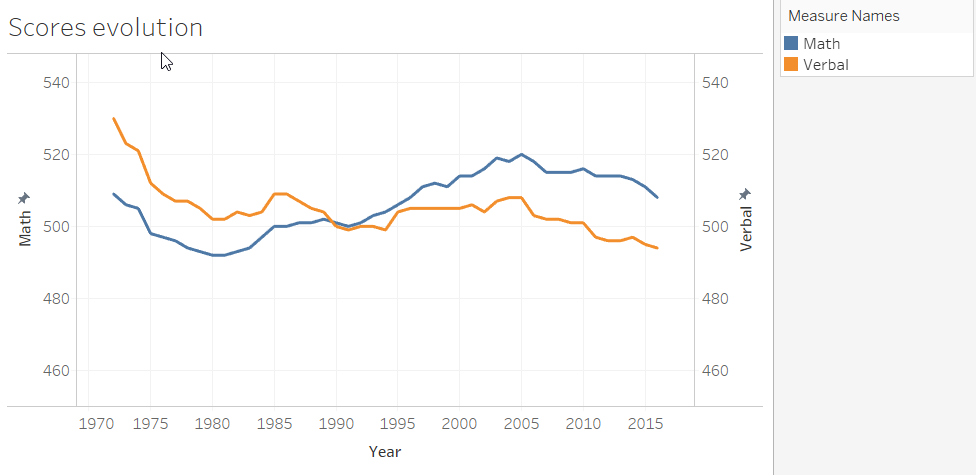

## Analysing SAT scores across the US
### Gregory Vial
### October 16th, 2016

#### About SAT scores
The SAT is an english, paper-based standardized test widely used for college admissions in the United States. It consists of 3 parts: math, verbal and essay.

Grading works as follows: 200–800 (in 10-point increments) on each of math and verbal.
The essay is scored on a scale of 0–24, in 1-point increments.

It is estimated that in 2015 over 1.6 million students over the world took the test.

In this article, we study average results for verbal and math in 2015 for each US states (essay is excluded). We also have statistics about the participation rate per state.

#### How does participation rate impact results

Based on the data available, we may ask ourselves whether there is a link between the participation rate and the scores.

Surprisingly, there seems to be such a correlation as shown in the graphs above. The higher the participation rate, the lower the average score for both math and verbal.

One possible interpretation is that in states with a high response rates, all types of students took part to the SAT. In states with a lower response rate, only the best students took part to it.

#### How math results impact verbal results (and vice versa)

We may also ask ourselves how verbal and math tests correlate to each other, if they do.

We can clearly see a very strong positive correlation between the math and verbal grades, i.e. in every states but one, the math score goes up witht he verbal score, and vice versa.

One possible interpretation is that in average students are usuly equaly good for both math and verbal. Those scoring high in one will score high in the other as well, and likewise those scoring low in one might score low in the other.
This interpretation would need more data to be supported as their might be other reasons explaining this correlation.

As mentionned, there is one exception where in average verbal score are much higher than math score, and this is Ohio. Lack of additional data prevents us from analysing further this fact.

#### Which states participate the most
By creating a heatmap of the participation rate per state, we have a very visual representation of _which states participate most_ ot the SAT tests.

What we clearly see is that east and west coast states tend to have a much higher participation rate than central states, with the exception of Texas and Indiana.

The explanation for this phenomena might be linked to the average income in coastal (more urbanised) states, which is higher than inland, more rural states. Wealthy families can aford to spend more on children education and pay for expensive college tuition fees, therefore in relatively richer areas, more students take the test.

#### Conclusion

As a conclusion we wanted to go a bit beyond that provided data and look at the evolution of average scores over the year.

For this we obtained the score evolution between 1972 and 2016 from wikipedia.

What the data show us is that in the seventies and eighties, average verbal score was consistently higher than the math score.
But there is a turning point in 1990, where math results exceeds verbal and this remains true throughout the following three decades.

Also there appears to be cycles, with scores decreasing over the seventies, increasing again (math) or staying flat (verbal) from 1980 to 2005, and then decreasing again since 2005.

